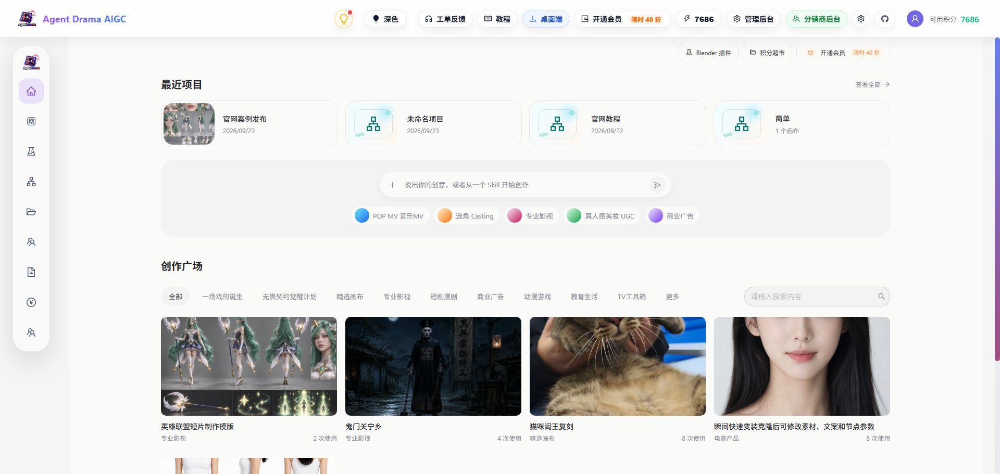
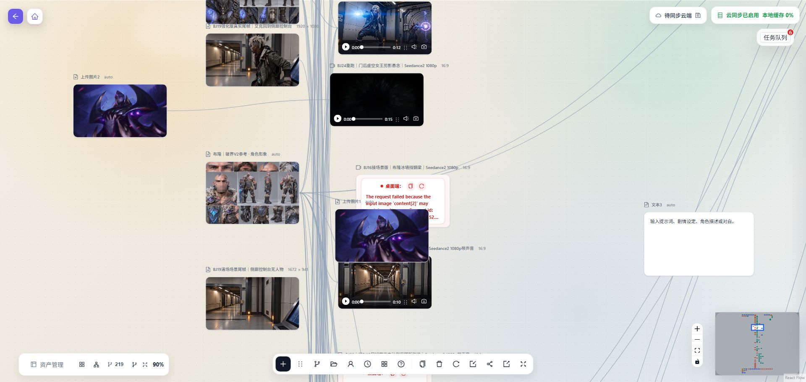
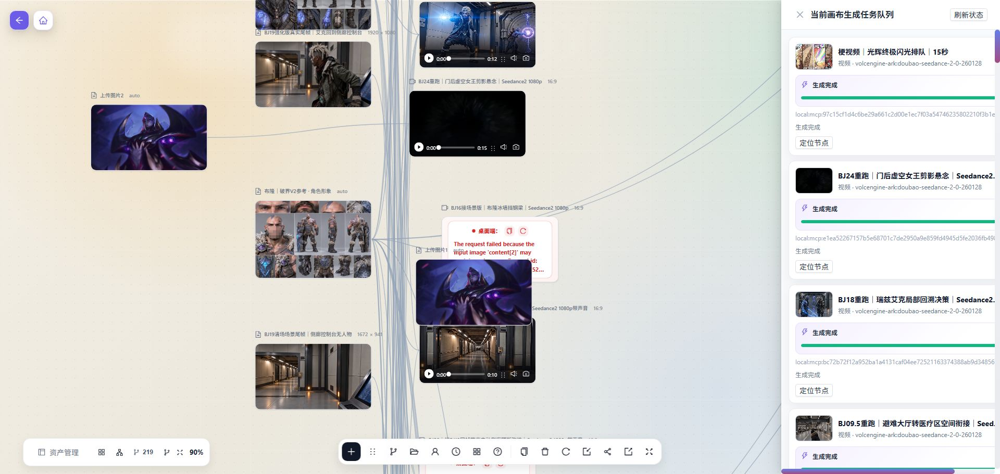
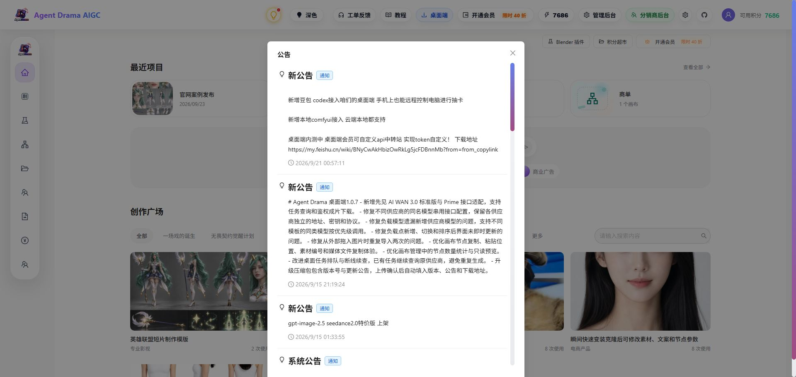
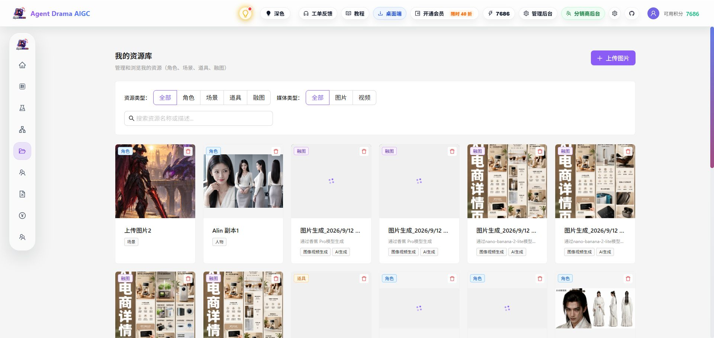
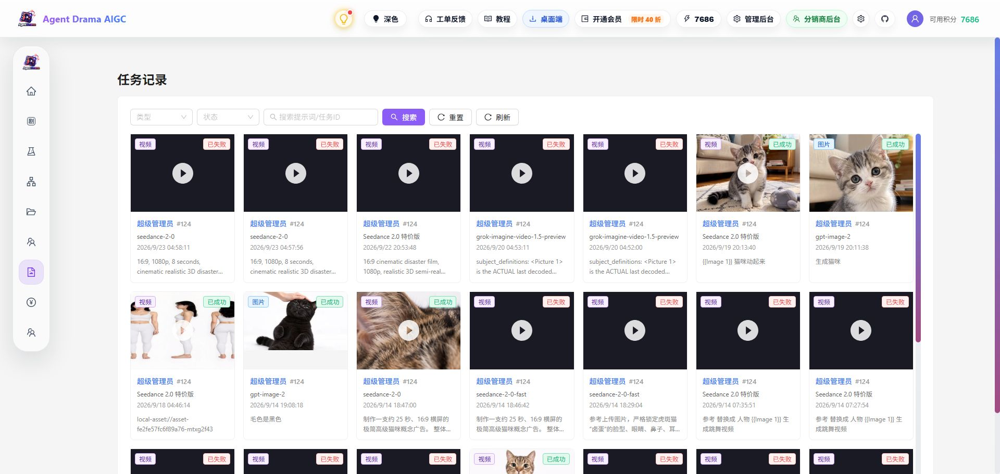

# Agent-Drama｜Agent Drama AIGC｜AI 短剧漫剧无限画布工作台

[🌍 GitHub](https://github.com/yy18570728781/Agent-Drama) | [🌐 官网工作台](https://agentdrama.top) | [📖 飞书教程](https://my.feishu.cn/wiki/BNyCwAkHbizOwRkLg5jcFDBnnMb)

---

> 🎬 **Agent Drama AIGC：面向 AI 短剧、AI 漫剧和小说改编视频的一站式桌面工作台**
> 支持无限画布、剧本分镜、角色场景素材、图片生成、视频生成、本地 ComfyUI、本地显卡算力、云端模型、豆包 / Codex / MCP 连接和公开画布案例。

---

## 🚀 快速入口

### 💻 直接使用 Agent Drama

- **官网 / 工作台入口**：<https://agentdrama.top>
- **飞书教程 / 桌面端下载与安装说明**：<https://my.feishu.cn/wiki/BNyCwAkHbizOwRkLg5jcFDBnnMb>
- **GitHub 产品介绍页**：<https://github.com/yy18570728781/Agent-Drama>

> 如果飞书教程打不开，可以复制链接到浏览器地址栏打开。

---

## 🔗 相关开源项目

Agent Drama 不是只用 GitHub 做下载入口。我们也公开了 AI 漫剧和无限画布相关项目，方便开发者本地部署、学习和二次开发：

- **AI-Comic-Director｜AI 短剧生产平台 / AI 漫剧创作工作台**：<https://github.com/yy18570728781/AI-Comic-Director>
- **AI-Comic-Director-Canvas｜无限画布创作模块**：<https://github.com/yy18570728781/AI-Comic-Director-Canvas>

简单理解：

- **Agent Drama**：面向创作者的桌面端和在线工作台入口，整合无限画布、本地 ComfyUI、本地显卡算力、云端模型、AI 助手连接和公开画布案例。
- **AI-Comic-Director**：开源短剧生产平台 / AI 漫剧创作工作台，适合开发者本地部署和二次开发。
- **AI-Comic-Director-Canvas**：无限画布模块开源项目，适合了解画布节点、素材编排和生成任务流。

---

## 🖼️ 产品截图

以下截图来自 Agent Drama 官网工作台登录态，展示的是用户侧创作流程，不包含管理后台页面。

### 官网工作台首页

### 创作广场与公开作品

### 无限画布节点连线

### 无限画布任务队列

### 本地 ComfyUI、Codex 和飞书教程公告

### 资源库

### 生成任务记录

---

## 🧩 Agent Drama 的无限画布是什么？

Agent Drama 的“无限画布”不是普通白板，而是 AI 短剧和 AI 漫剧制作流程里的创作中枢。

你可以把 **剧本、分镜、角色、场景、图片、视频、音频、首帧、尾帧和生成任务** 放在同一张画布上，用节点和连线表达素材引用关系。

例如：

- 角色图可以连接到图片生成节点，作为人物一致性参考。
- 场景图可以连接到视频生成节点，作为环境参考。
- 首帧、尾帧、音频可以连接到下游视频节点，控制镜头衔接和节奏。
- 生成出的图片或视频会回到画布里，继续作为下一镜的素材。
- 多个视频镜头可以进入剪辑流程，快速合成为短剧片段。

这样创作者不用在文档、生图工具、视频工具、网盘和剪辑软件之间来回切换，可以围绕一张画布持续推进整个故事。

---

## 🎯 为什么选择 Agent Drama？

### 传统 AI 视频制作的痛点

❌ **流程分散** - 剧本、素材、提示词、图片、视频和剪辑散落在多个工具里。
❌ **素材关系难管理** - 哪张角色图、场景图、首帧用于哪一个镜头，很容易混乱。
❌ **云端成本不可控** - 全部依赖云端模型时，积分和接口费用容易上升。
❌ **AI 助手难接入** - 豆包、Codex 或 MCP 工具很难直接理解本地创作进度。
❌ **复用案例困难** - 别人的制作流程、节点连线和提示词不容易学习或复制。

### Agent Drama 的解决方案

✅ **无限画布统一编排** - 把剧本、分镜、素材和生成任务放在同一张画布里。
✅ **节点连线表达引用关系** - 角色、场景、首尾帧、音频和下游任务关系更清楚。
✅ **本地 ComfyUI 和本地显卡算力** - 有本地显卡时，可以优先使用自己的电脑算力跑图和工作流。
✅ **云端和本地同时支持** - 按项目成本、速度和质量选择本地能力或云端模型。
✅ **豆包 / Codex / MCP 连接** - 让 AI 助手读取画布、整理节点、写入剧本、导入素材和准备生成任务。
✅ **公开画布案例** - 查看别人如何组织节点、连线、提示词和生成链路，也可以复制后继续编辑。

---

## ✨ 核心功能

### 📝 剧本与分镜

- ✅ **小说 / 大纲导入** - 把故事文本继续整理为可制作内容。
- ✅ **剧本到分镜** - 管理角色、场景、镜头、提示词和视频提示词。
- ✅ **连续镜头制作** - 围绕同一个故事维护角色、场景和镜头素材。

### 🧠 无限画布

- ✅ **文本、图片、视频、音频节点** - 把创作素材集中到一张画布里。
- ✅ **生成节点编排** - 图片生成、视频生成、剪辑流程都可以通过节点组织。
- ✅ **连线引用关系** - 上游素材直接作为下游任务的参考。
- ✅ **结果回填画布** - 生成结果继续作为下一步素材使用。

### 🎨 本地与云端生成

- ✅ **本地 ComfyUI 接入** - 支持把本地 ComfyUI 工作流接入创作流程。
- ✅ **本地显卡免费算力** - 已有本地部署环境时，可以优先使用自己的显卡跑图。
- ✅ **云端模型生成** - 支持按项目需要使用云端图片、视频、文本和音频模型。
- ✅ **多模态参考** - 支持角色图、场景图、首帧、尾帧、音频等参考输入。

### 🤖 AI 助手与 MCP

- ✅ **豆包连接** - 让豆包通过连接器参与本地桌面画布制作。
- ✅ **Codex / MCP 连接** - 让 AI 助手读取画布、整理节点和准备任务。
- ✅ **手机远程辅助流程** - 配合桌面端能力，适合远程查看和推进制作。

### 🎞️ 成片与案例

- ✅ **连线剪辑 / 智能剪辑** - 把多个镜头快速拼接成短剧片段。
- ✅ **创作广场** - 查看公开画布作品和制作流程。
- ✅ **公开画布复制** - 参考案例后复制到自己的项目继续编辑。

---

## 🧭 基础使用流程

1. 打开飞书教程地址，按教程下载并安装 Agent Drama 桌面端。
2. 登录官网工作台或桌面端，新建项目或打开已有项目。
3. 导入小说、剧本、图片、视频或音频素材。
4. 在无限画布里整理角色、场景、分镜和生成节点。
5. 如果你有本地显卡或 ComfyUI，可以先配置本地生成环境。
6. 用连线把角色图、场景图、首帧、尾帧、音频等素材连接到生成任务。
7. 生成图片或视频，结果自动回到画布中继续使用。
8. 需要成片时，把多个视频镜头加入剪辑流程并导出。

---

## 📌 适合谁使用？

### 📱 短视频创作者

- 制作抖音、小红书、B 站、视频号短剧内容。
- 用公开画布案例快速学习别人的节点流程。
- 把多个镜头快速合成为短片。

### 📚 小说 / 网文作者

- 把小说、大纲或人设转成短剧、漫剧视频。
- 为同一部作品沉淀角色、场景和连续镜头素材。
- 用 AI 辅助拆分镜和生成画面参考。

### 🎬 AIGC 工作室 / MCN

- 管理批量角色图、场景图、分镜图和视频镜头。
- 统一团队的素材引用和提示词流程。
- 根据项目需要选择云端模型或本地显卡算力。

### 🧑‍💻 本地部署与开发者

- 查看相关开源项目，学习 AI 短剧平台和无限画布实现方式。
- 接入本地 ComfyUI、本地模型和自定义生成流程。
- 通过 MCP / Codex / 豆包连接探索自动化创作流程。

---

## 📰 最新动态

- 新增 **本地 ComfyUI 接入**，云端和本地都支持。
- 新增 **豆包 / Codex 接入桌面端**，AI 助手可以参与本地画布制作。
- 桌面端支持自定义 API 中转站和模型配置，方便不同供应商模型接入。
- 公开画布和创作广场持续增加案例，方便学习节点连线、提示词和制作流程。

更多更新请查看官网公告和飞书教程：

- 官网工作台：<https://agentdrama.top>
- 飞书教程：<https://my.feishu.cn/wiki/BNyCwAkHbizOwRkLg5jcFDBnnMb>

---

## ❓ 常见问题

### 这是开源代码仓库吗？

这个仓库主要用于品牌搜索、飞书教程入口、下载入口和产品介绍，不是 Agent Drama 桌面端完整业务源码仓库。但我们有相关开源项目：

- AI 短剧生产平台 / AI 漫剧创作工作台：<https://github.com/yy18570728781/AI-Comic-Director>
- 无限画布创作模块：<https://github.com/yy18570728781/AI-Comic-Director-Canvas>

### 为什么 GitHub 上放这个产品介绍页？

很多用户会通过搜索引擎或社交平台搜索 Agent Drama、AI 短剧工具、AI 漫剧工具、智能画布、无限画布、连线剪辑、ComfyUI、本地显卡算力等关键词。这个仓库的作用是让用户快速确认产品是什么、适合谁、在哪里看飞书教程、在哪里下载、如何开始使用，以及去哪里查看相关开源项目。

### Agent Drama 和普通生图工具有什么区别？

普通生图工具通常只解决单次图片生成。Agent Drama 更关注短剧和漫剧制作流程：从文本、分镜、角色、场景、图片、视频到剪辑，尽量放在同一个无限画布项目里管理。

### 可以免费使用本地显卡算力吗？

可以。Agent Drama 桌面端支持本地 ComfyUI 接入和本地生成工作流。如果你的电脑已经部署好 ComfyUI 或本地模型，就可以优先使用自己的显卡算力来跑图和跑工作流，减少云端生成成本。

### 支持本地部署大模型吗？

支持围绕本地部署环境接入创作流程。你可以把本地 ComfyUI、本地模型能力和 Agent Drama 的画布、素材、分镜、生成节点结合起来使用；具体配置方式以桌面端设置和飞书教程为准。

### 豆包连接和 Codex / MCP 连接有什么用？

这些连接能力用于让 AI 助手参与本地创作流程，例如读取画布、整理节点、写入剧本、导入素材和准备生成任务。具体配置方式请以桌面端设置和飞书教程为准。

---

## 🔗 相关链接

- 🌐 [Agent Drama 官网工作台](https://agentdrama.top)
- 📖 [Agent Drama 飞书教程 / 桌面端下载与安装说明](https://my.feishu.cn/wiki/BNyCwAkHbizOwRkLg5jcFDBnnMb)
- 🏠 [Agent Drama GitHub 产品介绍页](https://github.com/yy18570728781/Agent-Drama)
- 🎬 [AI-Comic-Director｜AI 短剧生产平台 / AI 漫剧创作工作台](https://github.com/yy18570728781/AI-Comic-Director)
- 🧩 [AI-Comic-Director-Canvas｜无限画布创作模块](https://github.com/yy18570728781/AI-Comic-Director-Canvas)

---

## 📞 联系与反馈

如果你遇到下载、安装、登录、模型配置、画布生成、豆包连接、Codex / MCP 连接或视频剪辑问题，可以在 Agent Drama 工作台里提交反馈。

---

**⭐ 如果 Agent Drama 对你有帮助，欢迎给相关项目点 Star！⭐**

[🌐 官网工作台](https://agentdrama.top) | [📖 飞书教程](https://my.feishu.cn/wiki/BNyCwAkHbizOwRkLg5jcFDBnnMb) | [🎬 开源短剧平台](https://github.com/yy18570728781/AI-Comic-Director) | [🧩 无限画布模块](https://github.com/yy18570728781/AI-Comic-Director-Canvas)

---

## Star History

---

## 🔍 SEO 关键词

Agent Drama | Agent-Drama | Agent Drama AIGC | AI 短剧 | AI 短剧生成工具 | AI 漫剧 | AI 漫剧工具 | AI 漫剧片场 | 小说改编视频 | 小说改编短剧 AI 工具 | AIGC 视频工具 | 智能画布 | 无限画布 | ComfyUI | 本地 ComfyUI | 本地部署大模型 | 本地显卡算力 | 免费使用本地显卡 | 免费 AI 生图 | 连线剪辑 | 智能剪辑 | 豆包连接 | Codex MCP 连接 | 公开画布 | 创作广场 | AI-Comic-Director | AI-Comic-Director-Canvas

---

Agent Drama AIGC：给 AI 短剧、AI 漫剧和 AIGC 视频创作者使用的一站式创作片场。

